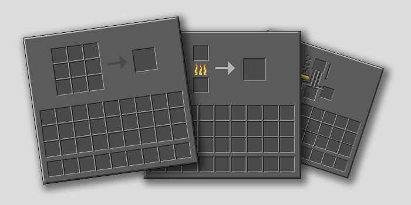

<!--
*** Thanks for checking out this README Template. If you have a suggestion that would
*** make this better, please fork the repo and create a pull request or simply open
*** an issue with the tag "enhancement".
*** Thanks again! Now go create something AMAZING! :D
-->

<!-- PROJECT SHIELDS -->
<!--
*** I'm using markdown "reference style" links for readability.
*** Reference links are enclosed in brackets [ ] instead of parentheses ( ).
*** See the bottom of this document for the declaration of the reference variables
*** for contributors-url, forks-url, etc. This is an optional, concise syntax you may use.
*** https://www.markdownguide.org/basic-syntax/#reference-style-links
-->
[![Contributors][contributors-shield]][contributors-url]
[![Forks][forks-shield]][forks-url]
[![Stargazers][stars-shield]][stars-url]
[![Issues][issues-shield]][issues-url]
[![License: CC BY-SA 4.0][license-shield]][license-url]
[![Contributor Covenant][code-of-conduct-shield]][code-of-conduct-url]

<!-- PROJECT LOGO -->
 

  

  <h3>SomeDarkCorner</h3>

  High resolution dark mode GUIs for Minecraft
   
   
  <a href="https://github.com/ScottKillen/SomeDarkCorner/issues">Report Bug</a>
  ·
  <a href="https://github.com/ScottKillen/SomeDarkCorner/issues">Request Feature</a>

<!-- TABLE OF CONTENTS -->
<!-- omit in toc -->
## Table of Contents

- [About The Project](#about-the-project)
- [Supported Mods](#supported-mods)
- [Contributing](#contributing)
- [License](#license)
- [Contact](#contact)
- [Acknowledgements](#acknowledgements)

<!-- ABOUT THE PROJECT -->
## About The Project

  

If you find yourself playing Minecraft in the dark, your eyes might thank you for a dark mode improvement.

These GUIs are double resolution and shaded to help relieve eye strain. minecraft's traditional rounded corners have been suared for a stylish sharper look.

<!-- SUPPORTED MODS -->
## Supported Mods

In addition to Vanilla Minecraft GUIS, this resource pack enhances the following minecraft mods:

- [Apotheosis](https://www.curseforge.com/minecraft/mc-mods/Apotheosis)
- [JEI (Just Enough Items)](https://www.curseforge.com/minecraft/mc-mods/jei)
- [TrashSlot](https://www.curseforge.com/minecraft/mc-mods/trashslot)

<!-- CONTRIBUTING -->
## Contributing

For additional information, see [CONTRIBUTING.md][contributing-url] for details.

<!-- LICENSE -->
## License

 SomeDarkCorner by <a xmlns:cc="http://creativecommons.org/ns#" href="https://github.com/ScottKillen" property="cc:attributionName" rel="cc:attributionURL">Scott Killen</a> is licensed under a <a rel="license" href="http://creativecommons.org/licenses/by-sa/4.0/">Creative Commons Attribution-ShareAlike 4.0 International License</a>.

<!-- CONTACT -->
## Contact

Scott Killen - [@scottkillen](https://twitter.com/scottkillen) - scott@scottkillen.com

Project Link: [https://github.com/ScottKillen/SomeDarkCorner](https://github.com/ScottKillen/SomeDarkCorner)

<!-- ACKNOWLEDGEMENTS -->
## Acknowledgements

This project is based on a work at <a xmlns:dct="http://purl.org/dc/terms/" href="https://github.com/xnebulr/Minecraft-Default-Dark-Mode" rel="dct:source">https://github.com/xnebulr/Minecraft-Default-Dark-Mode</a>.

Pack icon is [Angry eyes icon](https://game-icons.net/1x1/delapouite/angry-eyes.html#download) by [Delapouite](https://delapouite.com/) under [CC BY 3.0](http://creativecommons.org/licenses/by/3.0/).

<!-- MARKDOWN LINKS & IMAGES -->
<!-- https://www.markdownguide.org/basic-syntax/#reference-style-links -->
[contributors-shield]: https://img.shields.io/github/contributors/ScottKillen/SomeDarkCorner.svg?style=flat-square
[contributors-url]: https://github.com/ScottKillen/SomeDarkCorner/graphs/contributors
[forks-shield]: https://img.shields.io/github/forks/ScottKillen/SomeDarkCorner.svg?style=flat-square
[forks-url]: https://github.com/ScottKillen/SomeDarkCorner/network/members
[stars-shield]: https://img.shields.io/github/stars/ScottKillen/SomeDarkCorner.svg?style=flat-square
[stars-url]: https://github.com/ScottKillen/SomeDarkCorner/stargazers
[issues-shield]: https://img.shields.io/github/issues/ScottKillen/SomeDarkCorner.svg?style=flat-square
[issues-url]: https://github.com/ScottKillen/SomeDarkCorner/issues
[license-shield]: https://img.shields.io/github/license/ScottKillen/SomeDarkCorner.svg?style=flat-square
[license-url]: https://github.com/ScottKillen/SomeDarkCorner/blob/master/LICENSE.md
[code-of-conduct-shield]: https://img.shields.io/badge/Contributor%20Covenant-v2.0%20adopted-ff69b4.svg?style=flat-square
[code-of-conduct-url]: https://github.com/ScottKillen/SomeDarkCorner/blob/master/CODE_OF_CONDUCT.md
[contributing-url]: https://github.com/ScottKillen/SomeDarkCorner/blob/master/CONTRIBUTING.md
